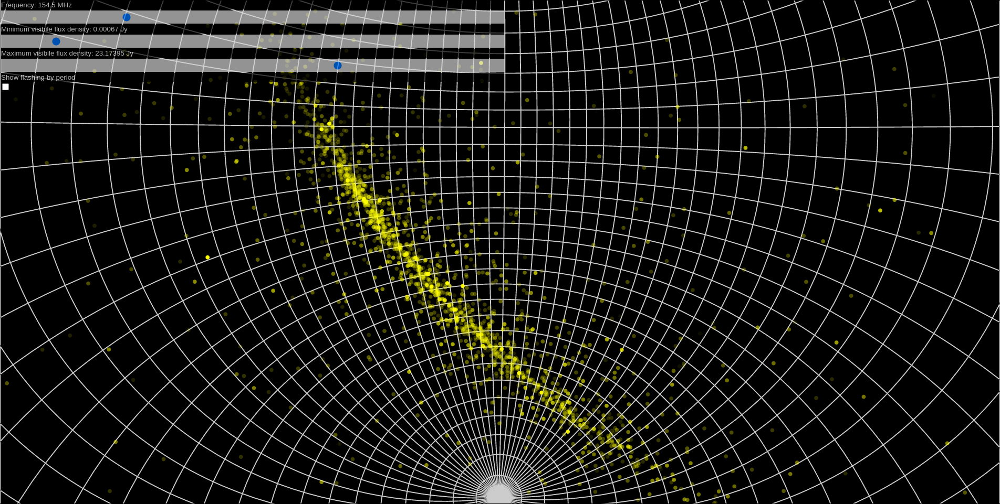

# pulsar-sky
A Django-based webapp to make an interactive map of pulsars in the radio sky

## Installation and setup

### psrcat

Follow the instructions at [the ATNF Pulsar Catalogue page](https://www.atnf.csiro.au/people/pulsar/psrcat/download.html).

> [!info]
> You will need catalogue >= v1.70. This has been tested up to v2.5.1.

### Django

#### Install (Python) dependencies

You may like to use a Python virtual environment.

In the `webmap` directory, run

```
pip install -r requirements.txt
```

#### Initialise (MySQL/Mariadb) database

Create an empty MySQL/Mariadb database called `pulsar_sky`:
```
Mariadb> CREATE DATABASE pulsar_sky;
```

Create the schema using Django's `migrate` utility.
```
python manage.py migrate
```

#### Create a Django superuser

In the `webmap` directory, run

```
python manage.py createsuperuser
```

...and follow the prompts.

#### Populate the database

The commands in this section are all intended to be run inside of a Django (Python) shell environment, which can be entered by running
```
python manage.py shell
```
on the command line. Once in the shell, import the core views and models:
```
from core import views, models
```

##### Import the ATNF catalogue of pulsars

Import the pulsar names, periods and a few other properties into the database:
```
views.import_atnf()
```

Imports the flux density data from the ATNF catalogue for the pulsars that have already been imported:
```
views.update_atnf_fluxes()
```

##### Create the spectrum models

```
views.init_spectrum_models()
```

##### Import spectral fits

> [!warning]
> These commands will take several (tens of) minutes to run.

Import the spectral fits available in `pulsar_spectra`:
```
views.import_spectra()
```

Fit power laws to ATNF pulsar data (for pulsars that don't already have spectral fits):
```
views.set_all_atnf_power_laws()
```

#### Run the server

In the `webmap` directory, run

```
python manage.py runserver [port]
```
where `[port]` can be any available port.
If none is provided, the default is 8000.

## Screenshot of pulsar sky map


